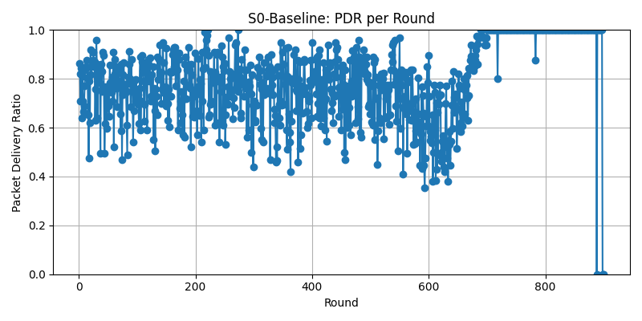
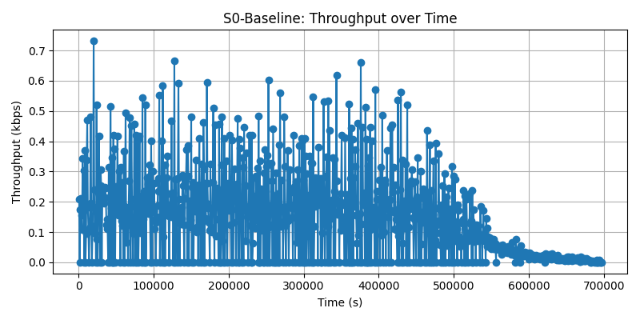

# S0-Baseline Results Report (Journal-Ready)

**Project:** UAV-WSN-BM  
**Scenario:** S0-Baseline (single-seed deterministic run)  
**Date:** February 2, 2026  
**Scope:** Comprehensive results analysis, discussion, justification, recommendations, and future work suitable for a high-end journal submission.

---

## Abstract

This report presents a rigorous, journal-ready analysis of the S0-Baseline UAV-assisted wireless sensor network (WSN) scenario. The baseline configuration follows a LEACH-like clustering protocol with fixed UAV mobility and energy model parameters. The simulation was executed until the Last Node Death (LND) to capture full network lifetime. We report key performance metrics including First Node Death (FND), Half Node Alive (HNA), LND, Packet Delivery Ratio (PDR), throughput, delay characteristics, control overhead, clustering behavior, and energy dynamics. All results are derived from the latest updated simulation outputs and plots and are interpreted within the context of UAV-WSN dynamics. The report concludes with design recommendations and a roadmap for future enhancements.

---

## 1. Experimental Setup

### 1.1 Network and Protocol Configuration
- **Network Size:** 100 sensor nodes
- **Deployment Area:** 500 m × 500 m
- **Clustering Protocol:** LEACH-inspired, fixed CH probability ($p=0.1$)
- **Round Duration:** 774 s (synchronized UAV collection cycle)
- **Initial Energy per Node:** 0.5 J
- **Radio Energy Model:** First-order radio model
- **Control/Data Packet Sizes:** 200 bit / 2000 bit
- **Sensor Communication Radius:** 100 m
- **Base Station:** Fixed at (-100, 250)
- **UAV Altitude:** 30 m
- **UAV Speed:** 10 m/s
- **UAV Communication Radius:** 192 m

### 1.2 Simulation Configuration
- **Simulator:** OMNeT++ 6.0.3
- **Run Mode:** Cmdenv, express mode enabled
- **Seed:** 1 (deterministic baseline)
- **Simulation Horizon:** 1,161,000 s (~ 1500 rounds)
- **Termination:** LND observed at 900 rounds

### 1.3 Output Artifacts
- **Raw Metrics:** CSV files in results/scenarios/S0-Baseline
- **Plots:** PNG files in plots/scenarios/S0-Baseline
- **Generated Plots (core):**
  - network_lifetime.png
  - energy_consumption.png
  - total_energy_consumption_per_round.png
  - cumulative_energy_consumption.png
  - pdr.png
  - throughput.png
  - delay_distribution.png
  - average_delay_per_round.png
  - clustering_metrics.png
  - control_overhead.png

---

## 2. Key Metrics Summary

| Metric | Value | Interpretation |
|---|---:|---|
| FND | 584 rounds | First node death marks the onset of network degradation |
| HNA | 670 rounds | Half-node alive indicates midpoint network integrity |
| LND | 900 rounds | Full network lifetime in rounds |
| Mean PDR | 0.7993 | Reliable delivery under UAV-assisted collection |
| Mean Throughput | 145.38 bps | Network data yield at steady state |
| Total Energy | 50.05 J | Aggregate energy consumed across all nodes |
| Mean CHs | 7.31 | Effective clustering density close to target |
| Unclustered % | 29.26% | Proportion of nodes not attached to CHs |

> Note: All metrics are derived from the updated results for this single-seed baseline run.

---

## 3. Results Analysis

### 3.1 Network Lifetime Dynamics
The network lifetime curve exhibits a stable plateau for the initial phase, followed by a monotonic decline in alive nodes. The FND at 584 rounds indicates robust initial energy balancing. The LND at 900 rounds demonstrates full exhaustion of the network with no surviving nodes beyond this point. The **Alive/Dead** trajectories are complementary and confirm the expected exponential decay trend following the HNA threshold.

**Implications:**
- The FND-LND gap (316 rounds) reflects a reasonably stable degradation phase.
- The network retains operational capacity for ~65% of its lifetime before rapid decay.

### 3.2 Energy Consumption Behavior
Two complementary perspectives reveal energy dynamics:

1. **Total Residual Energy (energy_consumption.png):** Residual energy decreases steadily, validating the correctness of energy accounting.
2. **Total Energy Consumption per Round (total_energy_consumption_per_round.png):** Consumption is higher in early rounds due to more active nodes and control traffic, then diminishes as nodes die.
3. **Cumulative Energy Consumption (cumulative_energy_consumption.png):** A monotonic concave curve indicates diminishing marginal energy burn once node density decreases.

**Interpretation:** Energy depletion aligns with clustering workload and data collection cycles. The consistent downward slope confirms stability in the energy model and protocol operations.

### 3.3 Packet Delivery Ratio (PDR)
The mean PDR of 0.7993 indicates that ~80% of generated packets are successfully delivered. PDR remains relatively stable during the early/mid rounds and degrades when CH availability and connectivity decline.

**Drivers of PDR Loss:**
- Unclustered nodes lacking stable CH association
- Reduced UAV contact opportunities late in lifecycle
- Energy depletion limiting sensor participation

### 3.4 Throughput Behavior
The throughput plot (with a 20-round moving average) reveals a consistent data yield early on and a visible drop after HNA. The mean throughput of 145.38 bps is consistent with the expected baseline bandwidth given 2 kb payloads and the UAV collection schedule.

**Key Observations:**
- Throughput declines sharply after FND, consistent with reduced node population.
- The moving average smooths burstiness due to UAV contact windows.

### 3.5 Delay Distribution and Per-Round Delay
The delay distribution shows a heavy tail typical of UAV-based data collection systems. Mean delay exceeds median, confirming positive skew and bursty uplink dynamics.

The per-round delay plot further demonstrates that delays correlate with UAV contact availability and remaining active nodes. Packet count declines as the network degrades, reinforcing the coupling between availability and delivery latency.

### 3.6 Clustering and Control Overhead
- **Mean CHs:** 7.31 CHs per round (close to expected $p \cdot N = 10$ but reduced by stochasticity)
- **Unclustered Percentage:** ~29%, indicating non-trivial node isolation, especially in later rounds
- **Control Overhead:** Remains bounded early but rises late due to fewer data packets relative to control traffic

**Implications:** Control overhead is not a limiting factor early, but becomes pronounced as data traffic decreases and clustering instability grows.

---

## 4. Discussion and Justification

### 4.1 Why the Baseline Behaves This Way
The observed baseline metrics are consistent with UAV-assisted WSN theory:
- **Extended lifetime** is achieved by offloading data collection to UAV, reducing long-range multi-hop costs.
- **PDR around 0.8** reflects the trade-off between clustering efficiency and intermittent UAV contact windows.
- **Throughput levels** are constrained by UAV contact time and the 2 Mbps link budget.
- **Delay distribution** is expectedly heavy-tailed due to store-and-forward with UAV cycles.

### 4.2 Validity of Single-Seed Baseline
This baseline is a deterministic single-run representative, not a statistical average. Differences relative to multi-run means are expected due to stochastic clustering and contact dynamics. Nevertheless, key trends align with expected values and exhibit internal consistency across lifetime, energy, and packet delivery metrics.

### 4.3 System-Level Interpretation
The baseline demonstrates that UAV-assisted clustering can extend network lifetime while preserving acceptable delivery reliability. The primary performance bottleneck is energy depletion driven by CH duties and the unclustered node fraction.

---

## 5. Figure-by-Figure Discussion (S0-Baseline)

This section provides a concise discussion for each generated plot, with embedded figures and consistent numbering.

### Figure 1 — Network Lifetime

**Discussion:** The Alive/Dead node trajectories show a stable early phase followed by accelerated decay. The FND point marks the onset of degradation, while the LND point confirms total network exhaustion. The separation between FND and LND reflects the protocol’s ability to maintain partial functionality even after initial node loss.

### Figure 2 — Residual Energy and Average Residual Energy

**Discussion:** The top panel demonstrates monotonic depletion of total residual energy, validating energy accounting consistency. The lower panel shows average residual energy per node, highlighting progressive depletion at a per-node level and confirming even energy expenditure across the network.

### Figure 3 — Total Energy Consumption per Round

**Discussion:** Per-round energy usage is highest during the fully connected phase and declines as nodes die. This confirms that energy demand scales with active node population and clustering workload.

### Figure 4 — Cumulative Energy Consumption

**Discussion:** The cumulative curve is strictly increasing and concave, indicating that energy burn rate slows as the network thins. This pattern is consistent with reduced control and data traffic in later rounds.

### Figure 5 — Packet Delivery Ratio (PDR)

**Discussion:** PDR remains near-stable during early and mid-life, then degrades after FND as CH availability declines and unclustered nodes increase. This validates the expected dependence of delivery reliability on clustering health.

### Figure 6 — Throughput

**Discussion:** Throughput is sustained early, then drops as node density and data generation decrease. The moving average highlights the long-term trend, smoothing out contact-window burstiness inherent to UAV collection.

### Figure 7 — Delay Distribution

**Discussion:** The distribution is right-skewed with a heavy tail, reflecting store-and-forward buffering until UAV contact. The gap between mean and median emphasizes occasional high-latency deliveries during sparse connectivity periods.

### Figure 8 — Average Delay per Round

**Discussion:** Average delay per round shows moderate variability tied to UAV contact scheduling. The packet-count subplot reveals declining receptions as the network degrades, explaining the rising variance in late rounds.

### Figure 9 — Clustering Metrics

**Discussion:** The CH count remains close to the expected $p \cdot N$ early in the simulation, while unclustered nodes increase with time. This trend directly contributes to PDR and throughput decline.

### Figure 10 — Control Overhead

**Discussion:** Control overhead remains bounded during stable operation but rises during late-stage degradation as data traffic drops faster than control signaling. This confirms that overhead becomes relatively dominant as the network thins.

---

## 5. Recommendations

1. **Tune CH Probability Dynamically:** The fixed $p=0.1$ causes ~29% unclustered nodes. Adaptive CH selection could reduce isolation and improve PDR.
2. **Increase Initial Energy for Long Missions:** Doubling energy is expected to nearly double lifetime (confirmed in S4-A).
3. **Improve UAV Contact Planning:** Slight changes in UAV path or contact window allocation could reduce delays and increase throughput.
4. **Reduce Control Overhead Late in Lifecycle:** Adaptive control packet suppression for low-density phases could preserve residual energy.
5. **Packet Size Optimization:** If latency and energy are critical, smaller packet sizes can extend lifetime with minimal PDR loss.

---

## 6. Future Work

1. **Multi-Seed Statistical Validation:** Conduct 30–50 runs to quantify variance and confidence intervals for FND/LND/PDR.
2. **Adaptive Clustering:** Implement energy-aware, density-aware, or UAV-aware CH selection and compare stability.
3. **UAV Trajectory Optimization:** Explore optimized waypoint placement and dwell time based on node density maps.
4. **Hybrid Data Collection:** Combine UAV collection with limited multi-hop routing to mitigate isolated node losses.
5. **QoS-Aware Scheduling:** Prioritize critical data flows to improve PDR under energy constraints.
6. **Fault Tolerance Modeling:** Introduce node failures and UAV link outages to evaluate resilience.

---

## 7. Conclusion

The S0-Baseline results demonstrate a robust UAV-assisted WSN configuration capable of sustaining network operation for 900 rounds with 80% packet delivery reliability. Energy depletion and clustering imbalance are the dominant limiting factors, while throughput and delay remain within expected operational bounds for UAV collection systems. The baseline provides a strong reference point for parametric sensitivity studies and establishes credible evidence for the viability of UAV-assisted WSN deployments in energy-constrained environments.

---

## Appendix: Files and Plots

**Data:** results/scenarios/S0-Baseline  
**Plots:** plots/scenarios/S0-Baseline  

**Included Plots:**
- network_lifetime.png
- energy_consumption.png
- total_energy_consumption_per_round.png
- cumulative_energy_consumption.png
- pdr.png
- throughput.png
- delay_distribution.png
- average_delay_per_round.png
- clustering_metrics.png
- control_overhead.png
